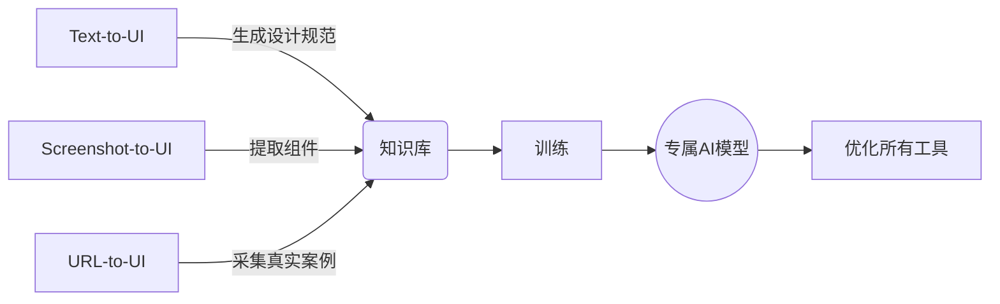
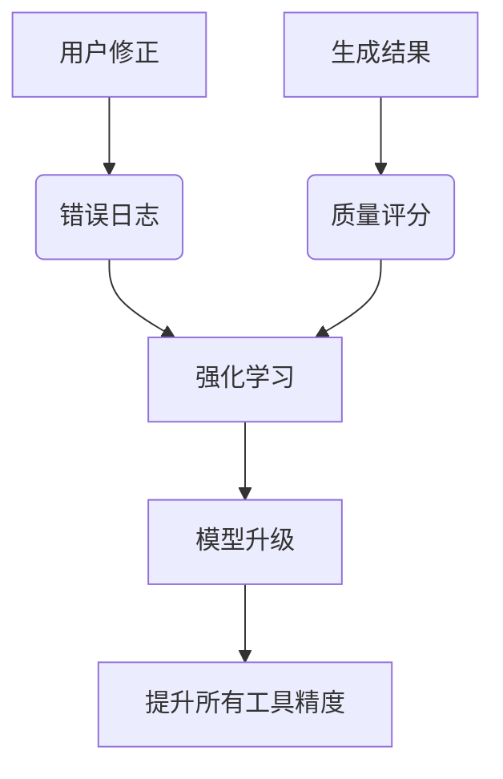

---

### **增强版产品规划：AI-Powered UI Factory**  
**产品定位**：一站式多模态 UI/UX 设计生成平台，支持从文本/图片/视频/URL 智能生成可编辑的前端代码与设计稿，覆盖完整设计工作流。

---

### **一、四大子工具功能架构**

#### **1. `/text-to-ui` 文本驱动设计生成**  
**目标用户**：产品构思阶段的创业者、独立开发者  
**核心流程**：  
```
文本输入 → AI 扩写需求 → 生成交互原型 → 输出设计系统  
```  
**功能细节**：  
- **多模型协作**：  
  - **Gemini**：进行开放性头脑风暴（如“生成10个社交类APP的导航栏创新方案”）  
  - **GPT-4**：结构化输出用户故事地图（User Story Mapping）  
  - **Stable Diffusion**：生成界面情绪板（Mood Board）  
- **智能组件推荐**：  
  - 根据文本关键词匹配设计模式库（如“仪表盘” → 推荐数据可视化组件）  
- **输出格式**：  
  - Figma 设计稿 + React/Vue 组件代码（含 JSDoc 注释）  
  - 交互流程图（通过 Mermaid.js 自动生成）  

**技术实现**：  
```python  
# 多模型协作示例  
def text_to_ui(prompt):  
    # 步骤1：需求扩展  
    expanded_prompt = gemini.generate(  
        "你是一个资深产品经理，请将以下需求扩展为详细PRD:\n" + prompt  
    )  
    # 步骤2：生成设计稿描述  
    design_desc = gpt4.generate(  
        f"将以下需求转换为Figma设计稿描述（包含图层结构）:\n{expanded_prompt}"  
    )  
    # 步骤3：转换为实际代码  
    return figma_api.convert(design_desc, output_format="react")  
```

---

#### **2. `/screenshot-to-ui` 截图转可编辑设计**  
**目标用户**：UI 逆向工程需求者、外包团队  
**核心创新**：  
- **像素级还原**：  
  - 通过超分辨率技术增强模糊截图  
  - 自动识别相近字体（如截图中的字体 → 匹配 Google Fonts 库）  
- **设计规范检测**：  
  - 标注不符合 Material Design/iOS HIG 的细节（如按钮最小点击区域不足）  
- **高级功能**：  
  - **PSD 重建**：从截图还原分层 PSD 文件  
  - **响应式推导**：通过多张截图反推断点规则  

**技术栈**：  
```  
+---------------------+  
| 截图输入            |  
|  ↓                  |  
| 图像预处理          | ← OpenCV（去噪/透视校正）  
|  ↓                  |  
| 元素分割            | ← Mask R-CNN 实例分割  
|  ↓                  |  
| 样式提取            | ← 颜色聚类分析 + 字体识别  
|  ↓                  |  
| 代码生成            | ← AST 抽象语法树构建  
+---------------------+  
```

---

#### **3. `/screenrecording-to-ui` 录屏转交互原型**  
**目标用户**：动态交互设计研究者、竞品分析专家  
**核心能力**：  
- **时空分析**：  
  - 关键帧提取（通过光流法检测界面突变点）  
  - 手势轨迹识别（滑动速度/方向 → 推导交互逻辑）  
- **状态机还原**：  
  - 自动生成界面跳转流程图  
  - 标注过渡动画参数（如 duration: 300ms, easing: cubic-bezier(0.4, 0, 0.2, 1)）  
- **输出物**：  
  - 可交互原型（通过 Protopie/Framer 格式导出）  
  - Lottie 动画 JSON 文件  

**算法亮点**：  
```python  
# 基于视频的交互逻辑还原  
def detect_interaction(video_path):  
    frames = extract_key_frames(video_path)  
    state_transitions = []  
    prev_ui_state = analyze_frame(frames[0])  
    for frame in frames[1:]:  
        current_ui_state = analyze_frame(frame)  
        # 对比差异检测操作类型  
        action = compare_states(prev_ui_state, current_ui_state)  
        state_transitions.append({  
            "trigger": action,  
            "from": prev_ui_state,  
            "to": current_ui_state  
        })  
    return generate_xstate_config(state_transitions)  
```

---

#### **4. `/url-to-ui` 全站克隆引擎**  
**目标用户**：需要快速迁移系统的企业开发者  
**核心突破**：  
- **深度爬取**：  
  - 自动遍历所有子页面（通过链接递归 + sitemap.xml 解析）  
  - 识别动态路由（如 `/users/:id` → 生成 mock 数据）  
- **框架感知**：  
  - 检测 React/Vue/Angular 技术栈特征  
  - 自动重建组件树（如识别 Vue 单文件组件结构）  
- **智能脱敏**：  
  - 替换敏感数据（如将真实邮箱改为 user@example.com）  
  - 移除跟踪代码（自动识别 Google Analytics/Hotjar 等脚本）  

**处理流程**：  
```  
1. 爬取页面 → 生成 DOM 快照  
2. 静态分析 → 提取 CSS/JS 依赖  
3. 动态分析 → 记录 XHR/Fetch 请求模式  
4. 生成 Mock Server → 复现 API 行为  
5. 输出完整前端工程（含 Docker 部署配置）  
```

---

### **二、系统联动设计**

#### **跨工具协作场景**  
1. **组合用例**：  
   - 用 `/text-to-ui` 生成初稿 → 通过 `/screenrecording-to-ui` 添加交互 → 用 `/url-to-ui` 部署到线上  
2. **逆向增强**：  
   - 对 `/url-to-ui` 生成的页面使用 `/screenshot-to-ui` 进行局部优化  
3. **数据闭环**：  
   - 所有工具生成的设计自动进入 **统一知识库**，用于训练专属 AI 模型  

#### **联动技术实现**  


---

### **三、企业级功能扩展**

#### **DevOps 集成**  
- **CI/CD 管道**：  
  - 对生成的代码自动运行 Lighthouse 测试  
  - 生成 SonarQube 兼容的质量报告  
- **设计版本控制**：  
  - 基于 Git 的设计稿差分对比（如比较 Figma 版本差异）  
  - 自动生成 CHANGELOG（记录每次 AI 修改的意图）  

#### **安全合规模块**  
- **GDPR 助手**：  
  - 自动添加 Cookie 同意弹窗  
  - 检测并移除指纹追踪代码  
- **License 检查**：  
  - 扫描生成代码中的开源协议冲突（如 GPL 污染检测）  

---

### **四、技术风险与对策**

| 风险点 | 解决方案 |  
|---------|--------|  
| 截图还原精度不足 | 训练领域专用的 UI 分割模型（标注10万+截图数据集） |  
| 动态网页爬取失败 | 结合 Headless Browser 行为录制与重放 |  
| 生成代码不可维护 | 强制遵循 Airbnb 代码规范 + 添加类型注解（TypeScript） |  
| 多工具数据孤岛 | 建立统一的 UI Schema 标准（类似 OpenAPI Spec） |  

---

### **五、商业落地场景**

1. **外包替代方案**：  
   - 输入竞品视频 → 72小时内生成高仿系统 MVP  
2. **遗产系统迁移**：  
   - 解析旧版 ASP/JSP 页面 → 生成现代 React/Vue 代码  
3. **无障碍改造服务**：  
   - 对政府网站进行自动化 WCAG 2.1 升级  

--- 

该增强方案可实现 **"Any Input → Production-Ready UI"** 的终极目标，需重点关注不同输入模态的特征融合与误差修正。是否需要进一步探讨某个子工具的商业化路径或技术细节？


### **扩展子工具集：UI复刻生态矩阵**  
围绕界面复刻核心能力，新增以下垂直场景子工具，形成 **11大复刻维度** 的完整解决方案：

---

### **5. `/designfile-to-ui` 设计稿转代码**  
**目标用户**：UI 设计师、前端开发者  
**核心能力**：  
- **多格式解析**：  
  - Figma/Sketch/Adobe XD 文件直读（通过官方 API）  
  - 自动提取 Design Token（颜色/字体/间距）  
- **智能还原**：  
  - 将矢量图形转换为 SVG 或 Canvas 代码  
  - 自动标注切图导出规则（@2x/@3x 适配）  
**技术栈**：  
```python  
# Figma 文件解析示例  
figma_file = figma.get_file('FILE_KEY')  
components = figma_file.get_components()  
for node in components:  
    if node.type == 'FRAME':  
        generate_react_component(node)  
```

---

### **6. `/apk-to-ui` APK 逆向工程**  
**目标用户**：移动端逆向工程师、跨平台开发者  
**核心流程**：  
```  
APK 解包 → 解析 XML 布局 → 提取资源文件 → 生成 Flutter/React Native 代码  
```  
**独特功能**：  
- **多端适配**：  
  - 将 Android XML 布局转换为 iOS SwiftUI 约束  
  - 资源文件自动云端化（替换本地图片为 CDN URL）  
- **交互逻辑推测**：  
  - 通过反编译 Java/Kotlin 代码推测点击事件处理逻辑  

---

### **7. `/pdf-to-ui` 文档转交互界面**  
**目标用户**：传统企业数字化部门、教育机构  
**核心创新**：  
- **文档结构分析**：  
  - 识别 PDF 中的表单字段 → 生成 HTML `<form>` 结构  
  - 将目录层级转换为侧边导航菜单  
- **智能增强**：  
  - 将静态表格转换为可排序/过滤的 DataGrid 组件  
  - 自动添加章节跳转锚点  

---

### **8. `/sketch-to-ui` 手绘草图转高保真**  
**目标用户**：概念设计师、产品顾问  
**技术亮点**：  
- **草图增强**：  
  - 使用 **GAN 模型** 将潦草线条转化为规整 UI 元素  
  - 智能补全缺失部分（如自动对称绘制未完成的图标）  
- **创意推荐**：  
  - 根据草图轮廓推荐组件变体（如不同风格的导航栏）  

---

### **9. `/voice-to-ui` 语音驱动动态调整**  
**目标用户**：无障碍场景、车载界面设计  
**交互模式**：  
- **实时语音指令**：  
  - _“将第三个卡片下移 20 像素”_ → 触发 CSS 定位修改  
  - _“所有按钮增加圆角”_ → 批量修改 Border Radius  
- **声纹鉴权**：  
  - 识别团队成员声纹控制权限（如仅负责人可导出代码）  

---

### **10. `/3d-to-ui` 空间界面转平面**  
**目标用户**：AR/VR 开发者、游戏 UI 设计师  
**核心能力**：  
- **三维投影**：  
  - 将 3D 界面 UV 展开为 2D 布局  
  - 自动生成 CSS Transform 3D 等效代码  
- **交互映射**：  
  - 将手柄操作转换为鼠标事件（如扳机点击 → onClick）  

---

### **11. `/legacy-to-ui` 遗产系统现代化**  
**目标用户**：政府机构、金融企业  
**关键技术**：  
- **技术栈转换**：  
  - 将 Flash 动画转换为 Lottie Web + Canvas 实现  
  - 将 Silverlight 控件重写为 Web Components  
- **渐进式增强**：  
  - 生成兼容 IE11 的 Polyfill 包与现代化代码双版本  

---

### **12. `/motion-to-ui` 动效转交互代码**  
**目标用户**：动效设计师、前端工程师  
**处理流程**：  
```  
AE 工程文件/GIF 输入 → 解析关键帧 → 生成 CSS 动画/React Spring 配置  
```  
**高级功能**：  
- **性能优化**：  
  - 自动将复杂动画转换为 GPU 加速属性（transform/opacity）  
  - 生成 `will-change` 与 `requestAnimationFrame` 优化方案  

---

### **13. `/mockup-to-ui` 实物模型转数字界面**  
**目标用户**：工业设计师、硬件创业者  
**创新方案**：  
- **三维重建**：  
  - 通过多角度照片生成 2.5D 界面（正交投影）  
  - 将物理旋钮操作映射为滑块组件  
- **材质映射**：  
  - 识别实体模型表面纹理 → 生成 CSS `background-image`  

---

### **工具协同矩阵**  

| 输入类型       | 对应工具          | 输出联动场景示例                  |  
|----------------|-------------------|-----------------------------------|  
| 物理设备       | `/mockup-to-ui`   | → 3D 模型 → `/3d-to-ui`           |  
| 设计师手绘     | `/sketch-to-ui`   | → Figma 文件 → `/designfile-to-ui`|  
| 竞品 APK       | `/apk-to-ui`      | → 界面截图 → `/screenshot-to-ui`  |  
| 用户语音反馈   | `/voice-to-ui`    | → 修改指令 → `/text-to-ui`        |  

---

### **技术底层支撑**  
#### **统一中间表示层 (IRL)**  
```  
所有子工具输出统一为中间格式：  
{  
  "components": [  
    {  
      "type": "Button",  
      "styles": { "color": "#hex" },  
      "interactions": { "onClick": "handler" }  
    }  
  ],  
  "designSystem": { /* tokens */ }  
}  
```  
- 允许在不同工具间无损转换  
- 支持导出到任意前端框架  

#### **AI 训练数据闭环**  


---

### **商业化路径**  
1. **垂直行业解决方案**：  
   - 教育：将教材 PDF 转换为互动课件系统  
   - 电商：竞品页面克隆 + 个性化定制 SaaS  
2. **开发者生态**：  
   - 开源核心引擎，销售企业级扩展（如 APK 反编译模块）  
3. **硬件预装**：  
   - 与设计数位板厂商合作预装 `/sketch-to-ui` 工具  

---

该扩展方案构建了 **物理-数字-虚拟** 的全域界面复刻能力，下一步可深入探讨具体子工具的技术攻坚点（如 APK 逆向的混淆对抗）或商业模式验证方案。
